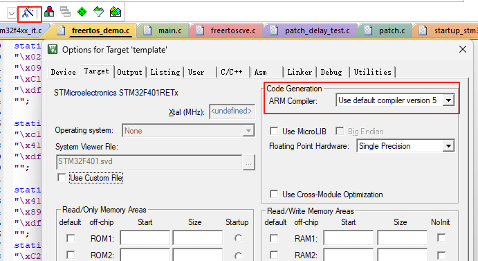
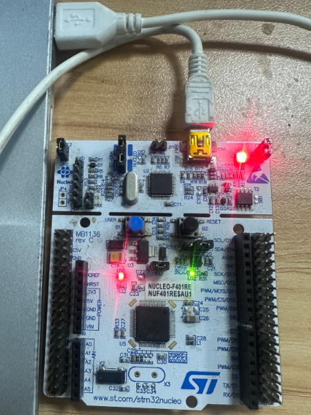
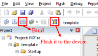
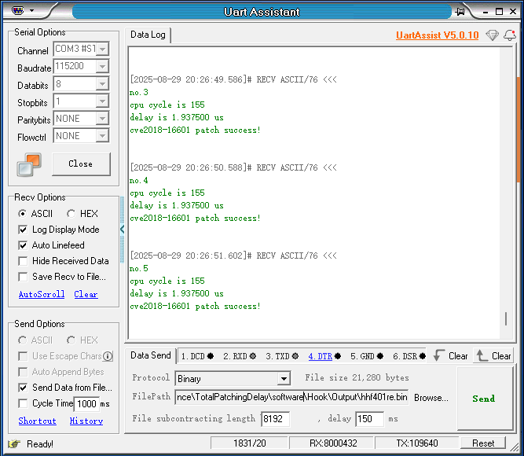

# StackPatch
**Hot-Patching Framework for Embedded Systems**  
Welcome to the artifact for the CCS 2025 submission of our paper, titled "Dynamic Vulnerability Patching for Heterogeneous Embedded Systems Using Stack Frame Reconstruction". StackPatch reconstructs stack frames to apply live security patches on embedded devices without rebooting.

## Table of Contents
1. [Repository Structure](#repository-structure)
2. [Getting Start Guide](#getting-start-guide)  
   - [Hardware and Software Requirements](#hardware_and_software_requirements)
   - [Usage Guide](#usage-guide)
   - [Demo Projects](#demo-projects) 
   - [Demo Directory Layout](#demo-directory-layout) 
4. [StackPatch implementation on other boards](#StackPatch_implementation_on_other_boards)
   - [GD32VF103](#gd32vf103)  
   - [ESP32S3](#esp32s3) 
5. [License](#license) 

---

## Repository Structure

StackPatch/  
├── Evaluation/  
│   └── Effectiveness/  
│   └── Performance/  
├── VulDevice/  
│   └── ESP32S3/  
│   └── GD32VF103/  
│   └── STM32F401RE/  
│   └── SerialTerminalTool/
└── README.md  


- **Evaluation/**: performance and scenario benchmarks.  
- **VulDevice/**: platform-specific StackPatch runtime and patch examples.  

---


## Getting Start Guide
## Hardware and Software Requirements:
- STM32F401RE (NUCLEO-F401RE board)
- Debugger: ST-LINK
- Windows 10  
- Keil µVision5 (MDK-Arm version < 5.3)
- Serial terminal tool (e.g.,  [UartAssist V5.0.10](https://www.nitwo.com/cn/download/UartAssist.html))  

It is important to note that due to university policies, external access to the university's internal internet is not allowed. Therefore, we cannot provide the AE committee with access to the boards. To run this project, the development board is a requirement.

## Usage Guide:
1. Install and launch [Keil µVision5](https://www.keil.com/download/) (MDK-Arm version < 5.36). Make sure your Keil IDE has the ARM Compiler Version 5 integrated.
  

2. Connect the board to your PC via debugger (The NUCLEO-F401RE board is integrated with ST-Link, so it can be connected using a USB cable).  


3. Open the Keil project. (e.g., double-click `StackPatch\VulDevice\STM32F401RE\flashpatch\fpbflashpatch\Projects\MDK-ARM\f401re.uvprojx`.)  
4. Build and flash the firmware.  

5. Use the serial terminal tool to view StackPatch log output. 


## Demo Projects:
This repository includes 9 demos that illustrate the development and application of patches, with STM32F401RE as the hardware platform:

- **VulDevice/STM32F401RE/flashpatch/dwtflashpatch**  
  DWT hardware-breakpoint patch mode.  
- **VulDevice/STM32F401RE/flashpatch/fpbflashpatch**  
  FPB hardware-breakpoint patch mode.  
- **VulDevice/STM32F401RE/srampatch/bootloader**  
  Bootloader for executing patched code in SRAM.  
- **VulDevice/STM32F401RE/srampatch/freertos_cve_test**  
  Software-breakpoint patch for FreeRTOS vulnerabilities.  
- **VulDevice/STM32F401RE/srampatch/sram_cve**  
  Software-breakpoint patch for other RTOS vulnerabilities.  
- **Evaluation/Performance/TotalPatchingDelay**  
  Total patching latency of StackPatch
- **Evaluation/Performance/DispatchDelayBinarySearch**  
  Patch dispatcher performance using binary search.  
- **Evaluation/Effectiveness/HeartRateSensor**  
  Patching a heart-rate sensor vulnerability.  
- **Evaluation/Effectiveness/SoftPLC**  
  Patching a soft-PLC vulnerability.  

You can start with the demo **VulDevice/STM32F401RE/flashpatch/fpbflashpatch**, which uses FPB hardware breakpoints to trigger StackPatch. 

## Demo Directory Layout (example):
> ```
> Drivers/      # HAL driver libraries  
> Middlewares/  # RTOS source code  
> Projects/     # Keil/Eclipse project files  
> Output/       # Compiled binaries  
> User/         # Application code  
> ```  
> - `startup_stm32f401xe.s`: modified `DebugMon_Handler` and `HardFault_Handler`.  
> - `cve.c`: vulnerable function from our paper.  
> - `patch.c`: hot-patch C source code.  
> - `freertos_demo.c`: hot-patch binary code.  
---

## StackPatch implementation on other boards
StackPatch has currently been implemented on three architectures: ARM, RISC-V, and Xtensa. If you want to run StackPatch on other boards, we also provide demo projects for the **GD32VF103** (based on the RISC-V32 architecture) and the **ESP32S3** (based on the Xtensa LX7 architecture) for your reference.

## GD32VF103
- IDE: Eclipse IDE (201909)
- Debugger: GD-Link    
Replace the component's `entry.S` (modified `trap_entry` handler) to integrate StackPatch.    

**Demo project:**
- **VulDevice/GD32VF103**  
  StackPatch on the RISC-V32 (GD32VF103) platform.
---

### ESP32S3
- Toolchain: ESP-IDF (Python, Git, cross-compilers, CMake, Ninja)  
- Debugger: J-LINK   
 
1. Replace `panic_handler_asm.S` in ESP-IDF (modified `xt_panic` handler).  
2. Run `instrument.py` to instrument target functions in ESP-IDF.  
3. Build and flash via ESP-IDF.  
4. Monitor serial output for StackPatch logs.

**Demo projects:**  
- **VulDevice/ESP32S3**  
  StackPatch on the Xtensa-LX7 (ESP32S3) platform.  
- **Evaluation/Effectiveness/NetworkService**  
  Patching network service vulnerabilities and measuring latency.
---

## License
This project is licensed under the MIT License.  
